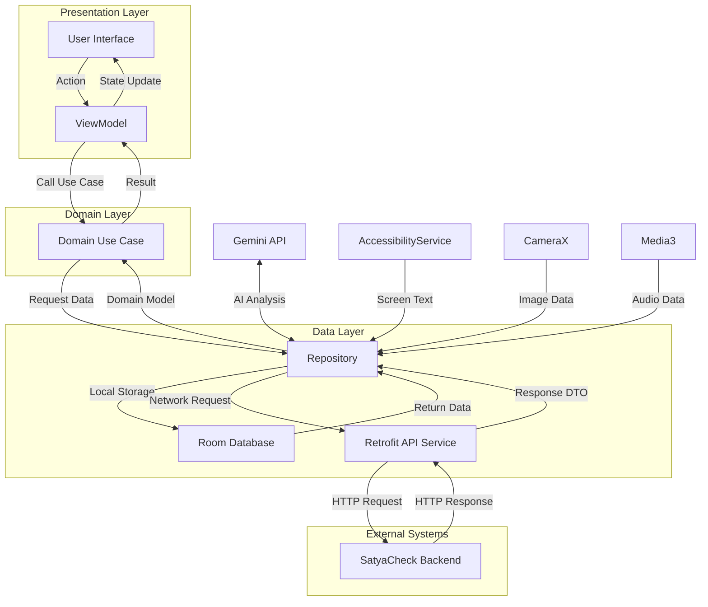

```mermaid
graph TD
    A[User Interface] --> |Action| B[ViewModel]
    B --> |Call Use Case| C[Domain Use Case]
    C --> |Request Data| D[Repository]
    D --> |Local Storage| E[Room Database]
    D --> |Network Request| F[Retrofit API Service]
    F --> |HTTP Request| G[SatyaCheck Backend]
    E --> |Return Data| D
    G --> |HTTP Response| F
    F --> |Response DTO| D
    D --> |Domain Model| C
    C --> |Result| B
    B --> |State Update| A

    subgraph Presentation Layer
        A
        B
    end

    subgraph Domain Layer
        C
    end

    subgraph Data Layer
        D
        E
        F
    end

    subgraph External Systems
        G
    end

    H[Gemini API] <--> |AI Analysis| D
    I[AccessibilityService] --> |Screen Text| D
    J[CameraX] --> |Image Data| D
    K[Media3] --> |Audio Data| D
```
